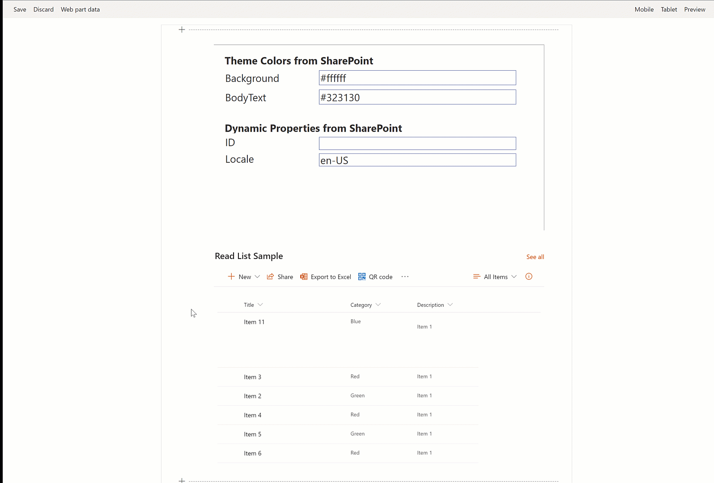
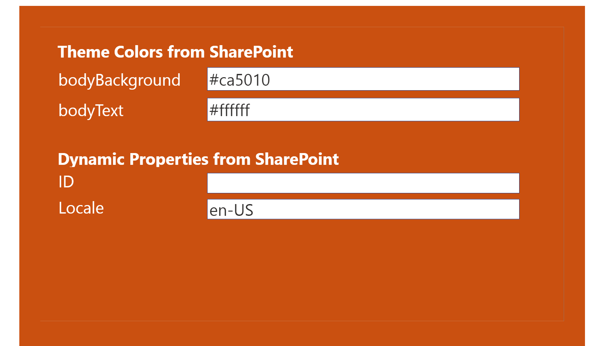
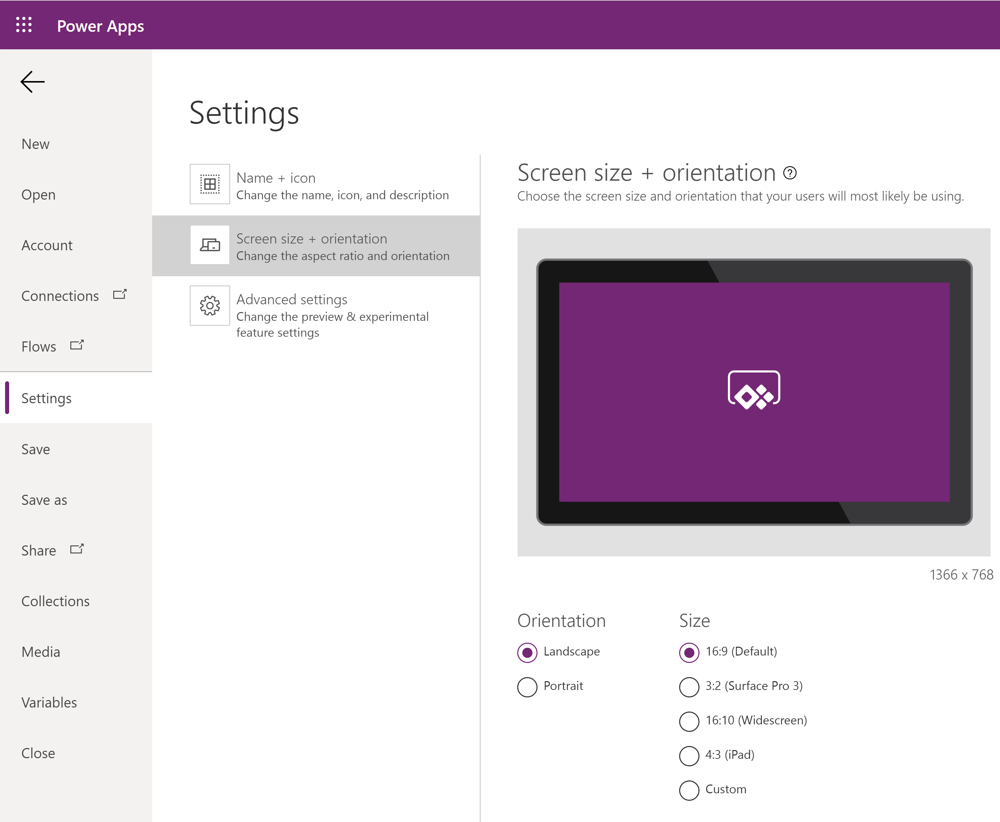
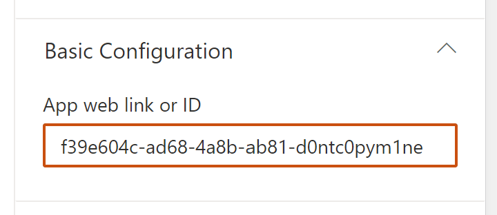
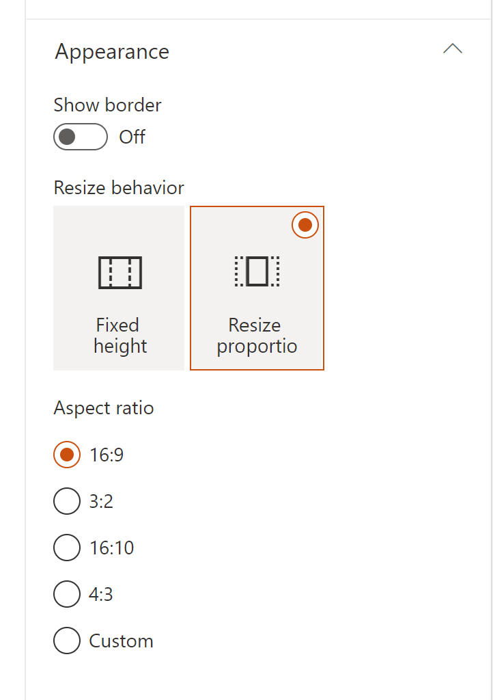
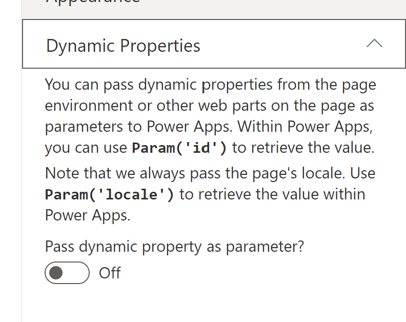

# Enhanced Power App

## Summary

When you want to embed a PowerApps Canvas app in a SharePoint page, the only way to achieve this is to use the OOTB component provided by Microsoft.

Unfortunately, the OOTB component lacks integration capabilities. The result is a degraded user experience and a perfectible UI.

Our component is based on Hugo Bernier's developments (https://github.com/hugoabernier/sp-dev-fx-webparts/tree/main/samples/react-enhanced-powerapps) and offers extensive parameterization for better integration of your Apps into your modern SharePoint pages, including :

1. Ratio control
2. Theme control
3. passing parameters (dynamic and static) to the app according to the SharePoint page context



It also resizes the app to fit the web part dimension:


## Compatibility

| :warning: Important                                                                                                                                                                                                                                                                           |
| :-------------------------------------------------------------------------------------------------------------------------------------------------------------------------------------------------------------------------------------------------------------------------------------------- |
| Every SPFx version is only compatible with specific version(s) of Node.js. In order to be able to build this sample, please ensure that the version of Node on your workstation matches one of the versions listed in this section. This sample will not work on a different version of Node. |
| Refer to <https://aka.ms/spfx-matrix> for more information on SPFx compatibility.                                                                                                                                                                                                             |


-Incompatible-red.svg> "SharePoint Server 2016 Feature Pack 2 requires SPFx 1.1")


## Applies to

- [SharePoint Framework](https://learn.microsoft.com/sharepoint/dev/spfx/sharepoint-framework-overview)
- [Microsoft 365 tenant](https://learn.microsoft.com/sharepoint/dev/spfx/set-up-your-development-environment)

## Prerequisites

You'll need at least one application in Power Apps that you wish to embed in SharePoint.

## Solution

| Solution                 | Author(s)                                                                                          |
| ------------------------ | -------------------------------------------------------------------------------------------------- |
| react-enhanced-powerapps | Hugo Bernier ([Tahoe Ninjas](http://tahoeninjas.blog/), [@bernierh](https://twitter.com/bernierh)) |

## Version history

| Version | Date             | Comments                            |
| ------- | ---------------- | ----------------------------------- |
| 1.0     | July 27, 2020    | Initial release                     |
| 1.1     | August 15, 2020  | Added improved resize event handler |
| 1.2     | January 20, 2022 | Update to SPFx v1.13.1              |

## Minimal Path to Awesome

- Clone this repository
- in the command line run:
  - `npm install`
  - `gulp serve`

> This sample can also be opened with [VS Code Remote Development](https://code.visualstudio.com/docs/remote/remote-overview). Visit https://aka.ms/spfx-devcontainer for more information.

### To Use

- Create a Power App
- In your app's **Settings** page (under **File | Settings** ), select the application size that suits your needs best
  .
- Make sure to keep **Scale to fit** on
- Once your app is saved and published, go to make.powerapps.com and find the **App ID** by browsing to **Apps**, selecting the app you wish to embed (_select it_, don't _launch it_) and viewing **Details**
- In the app details page, find the **Web link** or **App ID** and copy it.
  .
- Add the **Enhanced Power Apps** web part to a page.
- In the web part's property pane, paste the value you copied in the **App web link or ID** field.
- In the **Appearance** group, select **Maintain aspect** for the **Resize behavior** and select the **Aspect ratio** that matches the application size you selected earlier
  

You can also use dynamic properties to pass values from another web part on the page (or page context information) to Power Apps and/or make your app change colors to match the SharePoint page theme and section color.

## Features

This web part was created because the out-of-the-box Power Apps web part was missing some features that were important to me.

This Web Part illustrates the following concepts on top of the SharePoint Framework:

- Theme awareness
- Context awareness
- Dynamic data
- Property Pane HTML

### Theme Awareness

The sample demonstrates how to react to changing theme colors and section background colors. It can pass theme colors to the embedded Power Apps application.

If you want to use a color within Power Apps, simply use `Param()` to retrieve the value that is passed to Power Apps as a parameter, then use `ColorValue()` to convert the string value to a color Power Apps can use.

For example, if you select to pass the `bodyText` theme color, you can use the following expression within Power Apps to set the text color to match the SharePoint text color:

```
ColorValue(Param('bodyText'))
```

Remember that parameters are _case-sensitive_ in Power Apps. In the example above, make sure that you use `bodyText`, not `bodytext`.

### Dynamic Properties

This web part is a _dynamic property consumer_. For example, you can bind the Enhanced Power Apps web part to a list/document library web part on the page and make your Power App display information about the currently selected item in your list/document library.

To configure it, follow these steps:

- Add a **List** or **Document Library** web part on the page where your **Enhanced Power Apps** web part is located.
- In your **Enhanced Power Apps** web part's property pane, expand the **Dynamic Properties** group
  
- Turn on **Pass dynamic property as parameter?**
- Under **Dynamic property source** configure the following properties:
  - For **Connect to Source** select your list/document library web part name
  - In the **[Your web part name]'s properties** select **Column containing the filter value**
  - In the **Column containing the filter value**, select the column that has the value you'd like to pass to Power Apps
  - In the **Parameter name** field, enter the parameter name that you'll want to use within Power Apps to retrieve this value. For example, if you selected the `ID` field, type `ID`.
  - Within Power Apps, use `Param()` and the parameter name you specified above. For example, if you specified `ID` above, you'll want to use `Param('ID')` within Power Apps to retrieve the value. Remember that parameter names are _case-sensitive_.

Note that the web part always sends the current page's locale to Power Apps via the `locale` parameter. You can use this value to create multi-language apps.

### Property Pane HTML

This sample includes a `PropertyPaneHTML` control that you can use to embed custom HTML in a property pane. I use it to highlight syntax using the `<pre>` tag and to make text bold.

## Disclaimer

**THIS CODE IS PROVIDED _AS IS_ WITHOUT WARRANTY OF ANY KIND, EITHER EXPRESS OR IMPLIED, INCLUDING ANY IMPLIED WARRANTIES OF FITNESS FOR A PARTICULAR PURPOSE, MERCHANTABILITY, OR NON-INFRINGEMENT.**


